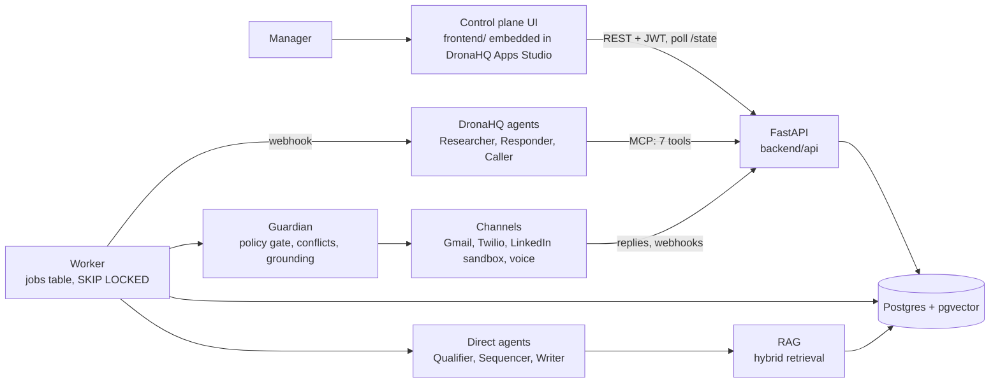

# Cadence

Cadence is an autonomous multi-channel SDR with a manager control plane. Managers create, configure, launch, pause and monitor campaigns, and a set of agents research, qualify, plan, write, send and answer inside those campaigns across email, LinkedIn, SMS and voice. One policy gate stands between every agent and every send, so a human stays in control while the agents do the work.

**One line:** launch a campaign, watch agents work it, pause it in one click.

Built for the Tech Contingent x DronaHQ Inter Guild Buildathon 2026 (18 to 20 September 2026). The demo seller is a fictional company, Helix Agents, and every seeded record carries a `DEMO` chip.

## Live demo

- App: the deployed URL is listed in the repository description and in `docs/submission.md`.
- Sign in with a demo chip on the login page, or use these demo-only accounts (password `helix-demo`): `admin@helix.demo`, `ava@helix.demo` (manager), `marcus@helix.demo` (rep).
- Self-serve tour for judges: `docs/demo.md`, section "Judge card".

## What it does

| Half | What is in it |
| --- | --- |
| Control plane | Campaign list, dashboards, lifecycle (Draft, Live, Paused, Completed, Archived), pre-launch checklist and dry run, four stop levels (campaign, agent, channel, global kill switch), prompt versions with diff and rollback, approvals inbox, conflict queue, rep management with offboarding, knowledge base, analytics, decision traces with replay |
| Intelligence layer | Qualifier, Researcher, Sequencer, Writer, Responder and Caller as visible roles, plus the Guardian: plain code for the policy gate, conflict engine and grounding check. Per-campaign RAG, structured outputs, guardrails, escalation, golden-set evals, cost per prospect, per qualified lead and per conversation |

Three campaigns run at once (US SaaS CTOs, India BFSI CIOs, US Voice AI Founders) and a fourth stays in Draft to show that a Draft cannot send. Pausing one leaves the others running, and `tests/integration/test_pipeline.py::test_pause_isolation_three_campaigns` proves it.

## Architecture



Agents never send anything. A send passes the ten ordered gate checks (kill switch, campaign state, agent, channel, suppression, claim, frequency, rep quota, daily cap, approval rule), takes a per-prospect advisory lock, and writes under an idempotency key. Details: `docs/architecture.md`.

## DronaHQ usage

| Component | What it does | What breaks without it |
| --- | --- | --- |
| Apps Studio app | Hosts the manager control plane, shared with Public Access | The workspace judges open |
| Researcher agent | Web search and enrichment, saves sourced facts through MCP | Research on DronaHQ (the direct provider takes over) |
| Responder agent | Reads replies with MCP tools, classifies, drafts, books or escalates | Reply handling on DronaHQ (direct provider takes over) |
| Voice agent | Places a real call with a briefing from our API | Live calls (a scripted outcome runs in sandbox) |

Set-up steps, instruction shells and screenshots live in `dronahq/`. Real engineer-written code sits under it: the state machine, gate, conflict engine, RAG, channels, MCP server and every rule.

## Quick start

```bash
git clone https://github.com/kiranG18/Buildathon-2026 && cd Buildathon-2026
cp .env.example .env
docker compose up -d db          # Postgres with pgvector on port 5433
pip install -e ".[dev]"
python scripts/bootstrap.py      # migrations and the demo workspace
EMBEDDED_WORKER=true python -m uvicorn backend.main:app --port 8000
```

Open http://localhost:8000. With `make`: `make db`, `make seed`, `make dev`, `make worker`, `make test`, `make lint`, `make reset`, `make schemas`. `make reset` rebuilds the schema and reloads the demo state in about five seconds.

Everything runs offline by default (`LLM_MODE=fake`): deterministic agents, a local embedder, sandbox channels. Add keys to switch pieces on. `python scripts/check_env.py` prints what is on.

## Environment variables

| Variable | Required | Purpose |
| --- | --- | --- |
| `DATABASE_URL` | yes | Postgres connection string. Use the direct or session-pooler connection (port 5432) on Supabase, because the worker relies on advisory locks and `FOR UPDATE SKIP LOCKED` |
| `JWT_SECRET`, `WEBHOOK_SHARED_SECRET`, `MCP_TOKEN` | production | 32+ random bytes each. The app refuses to start in production with the dev defaults |
| `BASE_URL`, `CORS_ORIGINS`, `APP_ENV`, `LOG_LEVEL` | production | Public URL, allowed browser origins, `production`, log level |
| `DEMO_MODE` | optional | Enables the reply simulator, clock and reset endpoints |
| `EMBEDDED_WORKER` | optional | Run the worker inside the web process. Two services is the recommended shape |
| `LLM_MODE` | optional | `fake` (offline), `live`, `record`, `replay` |
| `ANTHROPIC_API_KEY` | live LLM | Sonnet 5 (`claude-sonnet-5`) and Haiku 4.5 (`claude-haiku-4-5-20251001`) |
| `LLM_FALLBACK_PROVIDER`, `LLM_FALLBACK_KEY` | optional | Second provider after two timeouts |
| `EMBEDDINGS_API_KEY` | optional | Hosted embeddings (1536 dimensions). Without it a deterministic local embedder runs |
| `DRONAHQ_RESEARCHER_WEBHOOK_URL`, `DRONAHQ_RESPONDER_WEBHOOK_URL`, `DRONAHQ_API_KEY` | DronaHQ | Webhook trigger URLs and the API key |
| `DRONAHQ_VOICE_AGENT_ID`, `DRONAHQ_VOICE_CALL_URL` | DronaHQ voice | Voice agent and the call-start URL |
| `AGENT_PROVIDER_RESEARCHER`, `AGENT_PROVIDER_RESPONDER`, `AGENT_PROVIDER_CALLER` | optional | `dronahq` or `direct`. Flip one agent in one deploy |
| `GMAIL_CLIENT_ID`, `GMAIL_CLIENT_SECRET`, `GMAIL_REFRESH_TOKEN`, `GMAIL_SENDER`, `SEED_INBOX_BASE` | live email | Sandbox Gmail account |
| `SMTP_HOST`, `SMTP_USER`, `SMTP_APP_PASSWORD` | fallback | SMTP app password if Gmail OAuth fails |
| `TWILIO_ACCOUNT_SID`, `TWILIO_AUTH_TOKEN`, `TWILIO_FROM_NUMBER` | live SMS | Trial account, verified numbers only |
| `CHANNEL_MODE_EMAIL`, `CHANNEL_MODE_SMS`, `CHANNEL_MODE_LINKEDIN`, `CHANNEL_MODE_VOICE` | optional | Starting mode, `live` or `sandbox`. Settings can change it at runtime |
| `ALLOWED_RECIPIENTS` | production | Domains, addresses and phone numbers the adapters may contact. Anything else is refused |
| `WORKER_CAMPAIGN_ID` | optional | Limit one worker process to one campaign |

## Channel modes

| Channel | Live path | Sandbox path | Badge |
| --- | --- | --- | --- |
| Email | Gmail API from a sandbox account, threaded by Message-ID, replies polled every 30 seconds (SMTP fallback) | Writes to the database only | `LIVE` or `SANDBOX` |
| SMS | Twilio trial to verified team phones, inbound webhook with signature check | Sandbox handset | `LIVE` or `SANDBOX` |
| LinkedIn | none: automating a real account breaks LinkedIn's terms | Mock inbox, simulated acceptance, replies from the reply simulator | `SANDBOX` |
| Voice | DronaHQ Voice agent, pre and post webhooks | Scripted call outcome through the same recording path | `LIVE` or `SANDBOX` |

A channel without credentials sends nothing and its messages wear the `SANDBOX` badge. The reply simulator posts through the same `ingest_reply` function that Gmail polling and the Twilio webhook call.

## Agents and models

| Role | Runs on | Model |
| --- | --- | --- |
| Qualifier (ICP Fitment) | Direct | Haiku 4.5. Hard filters and the score are code |
| Researcher | DronaHQ, or direct enrichment | Platform model |
| Sequencer (Outreach Strategy and Follow-up) | Direct | Sonnet 5 for `plan`, rules for stop conditions |
| Writer (Personalisation) | Direct | Sonnet 5, with a grounding check in code |
| Responder (Conversation) | DronaHQ, or direct | Rules first, then a model |
| Caller (Voice SDR) | DronaHQ Voice | Platform voice model |
| Guardian | Plain code | none: no model can override it |

All calls go through `agents/llm_client.py`: 30-second timeout, two retries with backoff, JSON parse, Pydantic validation, one repair pass, a fallback provider, cost and latency logging.

## Tests

```bash
python -m pytest        # 86 tests against a real Postgres, results in docs/test-log.md
python -m ruff check .
python scripts/ui_smoke.py && python scripts/ui_flows.py   # browser checks (Playwright and Edge)
```

Covered: every gate check, the seven conflict cases and the send race, pause isolation, Draft refusing a send, prompt version stamping and rollback, reply handling, approvals, rep offboarding, kill switch, role checks, webhook secrets, injection and CORS, LLM failure injection (garbage, empty, timeouts, 429), retrieval quality, MCP tools, the DronaHQ fallback, Gmail and Twilio adapters.

## Repo map

```text
backend/        the deployable: api/, core/, orchestrator/ (state machine, worker, controls, replies),
                policy/ (gate, grounding), conflicts/ (claims and ladder), channels/, mcp/, analytics/
agents/         the AI layer: llm_client, prompt renderer, memory, one module per agent, output models, schemas/
rag/            chunking, embeddings, ingest, hybrid retrieval
evals/          golden sets, runner, prompt coach
database/       numbered SQL migrations
seed/           the demo workspace, dumped from the prototype's own seed driver
knowledge/      markdown knowledge files with frontmatter (global/ and one folder per campaign)
frontend/       the control plane UI: css/, js/, fonts/ (Onest and IBM Plex Mono, self-hosted), prototype/ (the reference)
dronahq/        agent shells, app spec, Vibe Coding prompts, screenshots
scripts/        bootstrap, reset, seed loader, schema export, UI checks
tests/          unit, integration, isolation, conflicts, failure
docs/           architecture, API, runbook, report, deck, demo script, test log
```

## Known limitations

- LinkedIn is a sandbox by design. Live LinkedIn automation is out of scope.
- With `LLM_MODE=fake` the agents are deterministic and their token and cost numbers are list-price estimates per agent, not measurements. Live mode records real usage.
- Golden-set scores come from 15 seeded cases per agent (five per campaign for the Qualifier and Writer) and, in fake mode, from rule-based agents. They are not production traffic.
- Prospect discovery reads a fixed demo lead source and CSV import. There is no live scraping.
- Meetings book against a mock rep calendar.
- Conflict ties surface in the Conflicts tab, not as a separate approval kind.
- The prompt-change approval workflow is not built.

## Team

Kiran Golagani (product, UI, DronaHQ). Commit history shows all authors.
