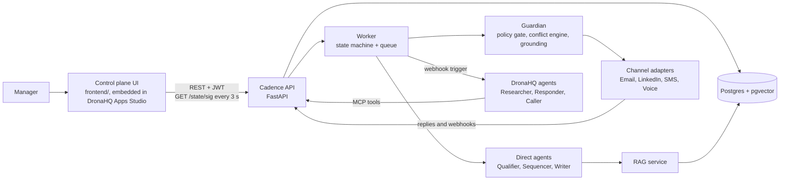
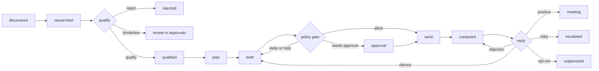

# Architecture

Cadence is one Python API, one worker, and a static control plane. Every rule that decides whether an action may happen lives in our code, so no agent can send a message on its own.

## Topology

The manager acts through the UI, the API records the intent, and the worker executes it. Every send passes the policy gate first and a channel adapter second. DronaHQ agents reach knowledge and prospect data through MCP tools served by the API.

## Modules

| Module | Owns |
| --- | --- |
| `backend/api` | FastAPI routers, JWT auth, role checks, request validation, the `/state` serializer |
| `backend/core` | config (fails fast in production), db pool, demo clock, security, structured logs, typed errors |
| `backend/orchestrator` | job handlers (research, qualify, plan, draft, reply), worker, controls, replies and approvals, discovery, campaign lifecycle, prompt versions, replay |
| `backend/policy` | `gate.py` (ten ordered checks), `grounding.py` |
| `backend/conflicts` | contact claims, the priority ladder, `resolve_claim` |
| `backend/channels` | the `Channel` interface, Gmail, SMTP and Twilio adapters, inbound polling, LinkedIn sandbox |
| `backend/mcp` | the MCP server: exactly seven tools |
| `agents` | `LLMClient`, prompt renderer, memory builder, one module per agent, Pydantic output models |
| `rag` | chunking, embeddings, ingest, hybrid retrieval with reciprocal rank fusion |
| `evals` | golden sets, runner, prompt coach |

## Enrollment state machine

Each prospect inside a campaign is an enrollment. Each transition writes one job for the next step and one `activity` row.

Job types: `research`, `qualify`, `plan`, `draft`, `reply`, and `call`. A worker claims due jobs with `FOR UPDATE SKIP LOCKED`, one claim query per Live campaign, capped at three running jobs per campaign. A per-job `try/except` records failures and retries at 30 seconds, 2 minutes and 10 minutes, then raises an `agent_failure` escalation.

## The Guardian

`backend/policy/gate.py` runs ten ordered checks and writes a reason code for each result:

1. Global kill switch is off
2. Campaign is Live (`campaign_not_live` for a Draft, `campaign_paused` for Paused)
3. The Writer agent is enabled for the campaign
4. The channel is enabled for the campaign and globally
5. The prospect is not suppressed
6. The contact claim belongs to this campaign
7. Contact frequency: one touch per prospect per 48 hours across all campaigns, four touches in 14 days. A reply to the prospect's own message is exempt
8. The rep has quota left and is active (`no_rep_available` for an offboarded rep)
9. Campaign and channel daily caps have room
10. The campaign's approval rule does not require a human

It answers `allow`, `defer` with a retry time, `hold` (kill switch, pause, agent off), `replan` (channel off), `block`, or `needs_approval`.

Five layers make a duplicate send impossible: one active claim per prospect (partial unique index), an idempotency key on every outbound message (unique), a per-prospect advisory lock during the send, a per-rep and per-campaign quota lock so parallel workers cannot each see room for the same last slot, and the frequency check that reads committed messages after taking the lock.

## Pause isolation

Pausing writes one row: `campaigns.status`. The worker's claim query joins each job to its own campaign and requires `status = 'live'`, so jobs of the other campaigns match their own Live rows and keep flowing. Queued jobs of the paused campaign stay `queued` and display as `held`. In-flight jobs finish, then the send step calls the gate again and receives `campaign_paused`, so nothing leaves. `test_pause_isolation_three_campaigns` runs three campaigns with 30 prospects each, pauses one, and asserts that within five seconds the other two write new activity while the paused one writes none.

## Conflict engine

`resolve_claim(prospect, campaign)` is deterministic code with no model. A prospect may sit in several campaigns, but only the campaign holding the single active claim may contact them. The ladder decides who holds it, and the first rung that separates the two campaigns wins:

1. Suppression blocks everything
2. A campaign with an active conversation keeps the claim
3. The customer-relationship campaign (Enterprise Expansion) outranks cold acquisition
4. Higher campaign priority
5. Higher ICP score
6. Earlier claim
7. An exact tie opens a conflict for a manager (Conflicts tab)

## Data model

Postgres tables (`database/migrations/`): `users`, `global_settings`, `integrations`, `campaigns`, `campaign_versions`, `campaign_agents`, `channel_settings`, `rep_assignments`, `prompt_versions`, `companies`, `prospects`, `enrollments`, `jobs`, `agent_runs`, `messages`, `activity`, `approvals`, `escalations`, `meetings`, `calls`, `contact_claims`, `conflicts`, `suppression_list`, `knowledge_documents`, `knowledge_chunks` (pgvector and a `tsvector`), `eval_sets`, `eval_runs`, `research_callbacks`.

Deviations from the execution plan, all deliberate:

| Plan | Built | Reason |
| --- | --- | --- |
| Separate `outreach` and `messages` | One `messages` table with a unique `idempotency_key` on outbound rows | Same guarantee with one write path |
| `representatives` table | Reps are `users` with the Rep role, plus `rep_assignments` | The prototype and the auth model already treat them as users |
| `analytics_daily` rollup | Metrics computed on demand from `messages`, `meetings` and `agent_runs` | The data set is small and the numbers stay equal to the database |
| Conflict tie as an `approval` of kind `conflict` | A `conflicts` row with no winner, shown in the Conflicts tab | Keeps one queue per object type |
| `agent_runs.input_snapshot` for replay | Replay re-runs the agent on the live enrollment with a pinned prompt version | Same demo result, no second copy of the memory |

## RAG

Knowledge lives as markdown in `knowledge/` and as rows in Postgres. Each file starts with YAML frontmatter and pins chunk ids with `<!-- K-207 -->` markers so citations survive re-ingest. Retrieval runs vector top 20 and full-text top 20, merges them by reciprocal rank fusion, and filters on the campaign or the global scope, never neither. Code picks the retrieval plan from the task. Web text never builds a query. If the embedding call fails, full-text search still answers. The Writer's `claims[]` are checked in code: every source id must exist and be visible to the campaign, every number must appear in its source, and banned phrases never pass.

## Failure handling

| Failure | Handled state |
| --- | --- |
| Model returns invalid JSON | One repair pass, then rule-based default or `agent_failure` escalation. The Qualifier never qualifies on failure |
| Model times out or returns 429 | Two retries with backoff, fallback provider, then rules. All providers down: jobs hold with an alert |
| DronaHQ agent unreachable or silent for 90 seconds | The step reruns on the direct provider, and the feed records `provider_fallback` |
| Channel send fails | Three retries, then an escalation. Three consecutive failures put the channel in error and raise an alert |
| Voice post-webhook never arrives | `unknown_outcome` plus an escalation after 10 minutes |
| Database call exceeds 5 seconds | 502 envelope, the UI shows a banner with Retry, the worker retries the job |
| Embeddings down | Full-text retrieval |

Every API error uses one envelope: `{"error": {"code", "message", "request_id"}}`. Logs are structured JSON with ids and never carry email addresses or message bodies.

## Security

JWT roles (admin, manager, rep) enforced on every route, with reps limited to their own campaigns and escalations. DronaHQ and Twilio callbacks carry a shared secret or a signature, checked in constant time. The MCP endpoint needs its own token. Passwords use PBKDF2. Ten wrong logins a minute return 429. CORS allows only the configured origin. Secrets live in environment variables only, and CI runs a secret scan. `ALLOWED_RECIPIENTS` gates every email and SMS send and stays on in production.
