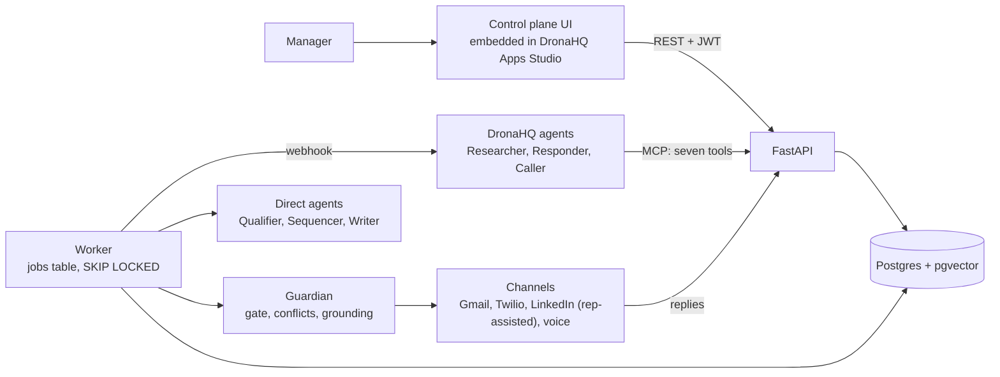

# Cadence: report

Inter Guild Buildathon 2026, Building the Autonomous SDR. Tech Contingent, IIT Madras, with DronaHQ.

## 1. Approach

The statement asks one question: how close is this to a real SDR working autonomously across channels? We answered with one product built from two halves that only make sense together. A control plane lets a manager create, launch, pause and monitor campaigns. An intelligence layer researches, qualifies, plans, writes, sends and answers inside those campaigns. We spent most of the 51 hours on a single working loop and put every rule that decides whether an action may happen in plain code, so a human always stays in control.

Five design rules make it feel like one SDR and not seven bots. Each one has an artifact in the UI:

1. **One prospect record, one memory.** Every agent reads the same enrollment timeline, so a LinkedIn reply changes what the email step says next.
2. **One planner owns channel choice.** Only the Sequencer decides channel and timing.
3. **One policy gate before every send.** A deterministic function checks ten rules. No agent bypasses it.
4. **One decision trace per action.** Each agent run stores its inputs, retrieved chunks, output, prompt version, cost and latency, and the UI shows it as a readable drawer.
5. **One escalation path.** Every agent raises the same escalation object into the same approvals inbox.

## 2. Architecture

The API and the worker share one Python image and one Postgres database. Postgres holds relational data, pgvector embeddings and full-text search, and the job queue is a table read with `FOR UPDATE SKIP LOCKED`, so there is no Redis or Celery to run. The UI polls a cheap signature every three seconds and fetches state only when it changes. `docs/architecture.md` has the state machine, the gate, the conflict ladder and the failure table.

## 3. Campaigns and agents

Four campaigns for a fictional seller, Helix Agents:

| Campaign | State | ICP | Channels | Approval rule |
| --- | --- | --- | --- | --- |
| C1 US SaaS CTOs | Live | US B2B SaaS, 100 to 1,000 staff, Series B to D | Email, LinkedIn | First touch autonomous, pricing replies need approval |
| C2 India BFSI CIOs | Live | Indian banks, NBFCs and insurers, 1,000+ staff | LinkedIn, email | Every first touch needs approval |
| C3 US Voice AI Founders | Live | Seed to Series A voice-agent startups | Email, LinkedIn, SMS, voice | Autonomous, every call needs approval |
| C4 Enterprise Expansion | Draft | Existing customers under 30% seat use | Email | Every send needs approval. A Draft cannot send |

Agents (the statement's seven roles map to six model-backed units plus the Guardian, as the execution plan argues):

| Statement role | Unit | Runs on |
| --- | --- | --- |
| ICP Fitment | Qualifier | Direct, Haiku 4.5. Hard filters and the score are code |
| Lead Research and Enrichment | Researcher | DronaHQ agent with our MCP tools, or direct enrichment |
| Outreach Strategy and Follow-up | Sequencer | Direct, Sonnet 5 for planning, rules for stop conditions |
| Personalisation and Email | Writer | Direct, Sonnet 5, grounding check in code |
| Conversation | Responder | DronaHQ agent, or direct. Rules first, model second |
| Voice SDR | Caller | DronaHQ Voice agent with pre and post webhooks |
| none | Guardian | Plain code. No model can override it |

Every campaign has a system prompt and per-role prompts with versions. Activating a version is one transaction, every agent run stores the prompt and campaign version it ran under, and one campaign's edit never touches another's rows (`test_f5_i2_*` asserts the other campaigns are byte-identical).

## 4. How DronaHQ is used

| Component | Role | What breaks without it |
| --- | --- | --- |
| Apps Studio app (Vibe app 77710) | Native sign in, Command Center with Stop all, campaign list with pause and resume, campaign dashboard with funnel and a switch per agent, plus the full workspace embedded. It calls our API directly with the signed-in user's token | The manager view inside DronaHQ. The hosted site stays the public entry point, because Public Access needs a licence this workspace lacks |
| Researcher agent | Web search and enrichment, saves sourced facts through our MCP tool | Research on DronaHQ. The direct provider takes over in one deploy |
| Responder agent | Reads replies with MCP tools | Reply handling on DronaHQ. The direct provider takes over |
| Voice agent | One real call with a briefing fetched from our API | Live calls. A scripted outcome runs through the same path |

Our own code holds the state machine, gate, conflict engine, RAG, channels, MCP server, the eval runner and every rule. DronaHQ is a genuine part of the system and not the whole of it: `backend/orchestrator/dronahq.py` triggers the hosted agents, `backend/mcp/` serves the seven tools they call, and `backend/api/voice.py` serves the voice webhooks. The set-up status of the DronaHQ side is in section 6.

## 5. Stack

Python 3.12, FastAPI, Pydantic v2, psycopg 3, Postgres 16 with pgvector and full-text search, one `LLMClient` that supports Anthropic (Sonnet 5, Haiku 4.5), Gemini and Groq with a second-provider fallback, a deterministic local embedder (a hosted embeddings API is optional), the Python MCP SDK, Gmail API and Twilio adapters, a static UI (vanilla JavaScript, Onest and IBM Plex Mono self-hosted) with no bundler, Docker, GitHub Actions (ruff, pytest, secret scan), and Railway (Singapore) with Supabase Postgres (Mumbai) for hosting. Row level security is on for every table, and the state endpoint is served from memory until the data changes.

## 6. What works, what is partial, what is skipped

| Area | Status | Notes |
| --- | --- | --- |
| Three concurrent campaigns, independent state, pause isolation | Working | Proven by test and in the UI |
| Campaign lifecycle, checklist, dry run, duplicate, versions | Working | Draft refuses a send with a real send attempt |
| Ten-check policy gate, idempotency, quota locks | Working | One unit test per check, plus the send race |
| Conflict engine | Working | The seven cases from the plan pass |
| Four stop levels | Working | Campaign, agent, channel, global |
| Prompt versions, diff, activate, rollback, lint, replay, coach | Working | Version stamped on every run |
| RAG per campaign, grounding check | Working | 8 of 10 retrieval queries land in the top three. Offline embedder |
| Golden-set evals | Working | Measured scores. See limitations |
| Rep assignment and offboarding | Working | Lists affected campaigns, defers with `no_rep_available` until reassigned |
| Approvals, escalations, human takeover | Working | |
| Analytics: cost per prospect, per qualified lead, per conversation | Working | Estimated costs in offline mode |
| Live deployment | Working | Railway and Supabase, seeded demo, worker running. Smoke test in `docs/spikes.md` |
| Email live path (Gmail API) | Working | Proven end to end on the live site: a discovered prospect got a real email, a reply was matched to the enrollment, classified and answered with meeting slots. Only `ALLOWED_RECIPIENTS` can receive real mail |
| SMS live path (Twilio) | Partial | Connected, connection test passes, and a real send reached Twilio. Twilio's trial rejects free-text SMS to Indian numbers (error 572006), so SMS stays a labelled sandbox |
| Voice live path | Partial | The DronaHQ Voice agent, its pre-call briefing webhook and its post-call webhook (translated and matched to the enrollment) are built and tested. The outbound dispatch call is wired to DronaHQ's API but needs an outbound number attached to the agent, so calls run as a labelled scripted call |
| Apps Studio app | Working | Native screens tested in a browser against the live API. Not public, see limitations |
| DronaHQ Researcher and Responder agents | Working | Hosted on the Agentic platform and run in production. The Researcher saves sourced facts through our MCP tool, the Responder submits its decision through `set_classification`. Both fall back to the direct provider on failure. Traced in `docs/spikes.md` |
| Model providers | Working | Groq is the live primary with a Gemini fallback, plus Anthropic support, behind one client with retries, a repair pass and a fallback. Live runs are in `docs/spikes.md`. A clean live-model golden run was not completed |
| LinkedIn | Rep-assisted | The site never sends a note. Agents write and queue it, and a person sends it. `scripts/linkedin_runner.py` is an optional local tool that sends a note through the browser bot in the user's own Chrome after a per-note confirmation. LinkedIn has no messaging API and its terms forbid automation |
| Users and roles | Working | Admins and managers add reps, managers and (admins only) admins with a generated password shown once. Everyone can change their own password |
| Edit campaign | Working | Name, objective, ICP, roles, geographies, exclusions, tone, threshold and cap, saved as a new campaign version. A draft can run its dry run from its own page |
| Prompt-change approval workflow, real calendar booking | Skipped | Stretch items |

## 7. Known limitations and trade-offs

- **Offline agents.** With `LLM_MODE=fake` the agents are deterministic and their token and cost figures are list-price estimates per agent, not measurements. Live mode records real usage.
- **Golden sets are small.** Fifteen seeded cases per agent (five per campaign for the Qualifier and Writer), scored by exact match and the grounding check. In offline mode the Writer's grounded output depends on the prompt text. The scores are evidence that the runner and the versions work, not production accuracy.
- **Fictional data.** The workspace ships empty and every campaign is archived. Discovery draws from an invented list of prospects and companies, and the CSV import takes real names with optional email, phone and LinkedIn URL. The seeded demo story can be rebuilt on a local database with `python scripts/reset_demo.py`.
- **Cross-region database.** The app runs in Singapore and the database in Mumbai, so each query costs about 80 to 150 ms. The state endpoint was cut from 168 queries to 24 and is cached until the data changes, which took a page load from about 14 seconds to under one. Moving the database next to the app would cut it further.
- **DronaHQ Public Access.** Making the Apps Studio app public needs a licence this workspace does not have, so reviewers use the hosted site and a DronaHQ login is needed for the app.
- **Twilio trial.** A trial account texts verified numbers only and rejects free-text SMS to Indian numbers (error 572006). SMS stays a labelled sandbox.
- **Model prices.** The cost table for Gemini and Groq holds list prices entered by hand. Token counts are measured, prices should be checked against the providers' pages.
- **Mock calendar.** Meetings book against a mock rep calendar.
- **Demo clock.** The clock offset compresses waiting time. It moves every due time consistently, and real time keeps running.
- **Replan count.** The plan expected nine replans when LinkedIn is paused on C1. The seeded data yields eight, and the docs say eight.
- **Single author.** The git history holds one author. The plan assumed three.

## 8. Requirement map

| # | Requirement | Where it is proven |
| --- | --- | --- |
| M1 | Three concurrent campaigns | `test_pause_isolation_three_campaigns`, the seeded workspace |
| M2 | Campaign as a first-class object with prompts | `campaigns`, `prompt_versions`, `test_f1_f2_*` |
| M3 | Prompt versions, rollback, isolation | `test_f5_i2_*` |
| M4 | Lifecycle, Draft never sends | `test_draft_campaign_refuses_a_send` |
| M5 | Campaign actions and dashboard controls | `test_f4_*`, the UI flows script |
| M6 | Isolation, duplicates, overlap, conflicts, frequency | `tests/conflicts/` (K1 to K9) |
| M7 | Per-campaign dashboard | `GET /campaigns/{id}/dashboard`, the Campaign Dashboard screen |
| M8 | Global versus campaign configuration, suppression | `global_settings`, `integrations`, `suppression_list`, gate check 5 |
| M9 | Prompt UI, version stamped on every action | Prompts screen, `agent_runs.prompt_version` |
| M10 | Four stop levels | `test_f4_*`, `test_i4_*`, `test_i5_*`, `test_f12_*` |
| M11 | Rep assignment and offboarding | `test_f9_*` |
| M12 | The seven named agents | `agents/`, section 3 |
| M13 | Per-campaign RAG | `test_r1_*`, `test_r2_*` |
| M14 | Structured output, tools, guardrails, escalation, evals | `agents/models.py`, MCP tools, grounding, `evals/` |
| M15 | Cost per prospect, per qualified lead, per conversation | `GET /analytics/campaigns`, the Analytics screen |
| M16 | DronaHQ in the core with engineer-written code | Section 4, `dronahq/`, `backend/mcp/` |
| M17 | Shared repo, clean folders, no committed secrets, README | This repository, the CI secret scan |
| M18 | Malformed output, API failure, empty states | `tests/failure/`, designed empty and error states in every screen |
| M19 | Report, live URL, repo, deck, demo | `docs/report/`, `docs/deck/`, `docs/demo.md`, `docs/submission.md` |
